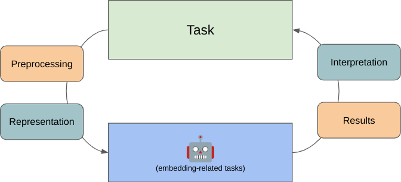
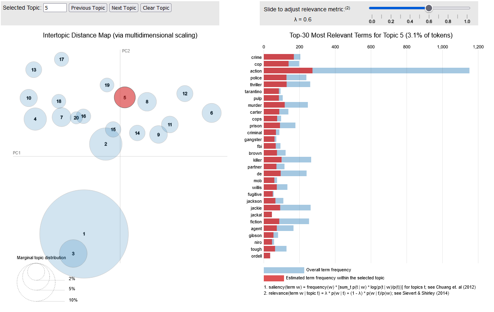

# Introduction

## What is Natural Language Processing?

Natural Language Processing (NLP) attempts to process human languages using computer models.

### What does NLP do?

There are many possible uses for NLP. Machine Learning and Artificial Intelligence can be thought of as a set of computer algorithms used to take data as an input and produce a desired output. What distinguishes NLP from other types of machine learning is that text and human language is the main input for NLP tasks.

A __model__ is a mathematical construct designed to turn our text input into a desired output,
which will vary based on the task. We can think of the various tasks NLP can do as different types of desired outputs, which may require different models depending on the task.

## Context for Digital Humanists

The humanities involves a wide variety of fields. Each of those fields brings a variety of research interests and methods to focus on a wide variety of questions.

These methods are not infallible or without bias. They are simply another tool you can use to analyze texts and should be critically considered in the same way any other tool would be. The goal of this workshop is not to replace or discredit existing humanist methods, but to help humanists learn new tools to help them accomplish their research.

## The Interpretive Loop



Despite the range of tasks we'll talk about, many NLP tasks, tools, and models have the same or related underlying data, techniques, and thought process.

Throughout this course, we will talk about an "interpretive loop" between your humanities research tasks and your NLP research tools. Along this loop are a number of common tasks we'll see again and again:

1. Designing a task, model and dataset to answer a question or solve some need in a way we think will be ethical and interesting.
2. Preprocessing the data so it can be processed by our model.
3. Representing our processed data as mathematical constructs that bridge (a) our human intuition on how we might solve a task and (b) the algorithms we're using to help with that task.
4. Running our model, allowing us to compute some output.
4. Outputting the result of our algorithms in a human readable format.
5. Interpreting the results as it relates to our research tasks, our interests, our stakeholders, and so on.

## NLP Tasks

Before we can get to any of that, we need to better understand what tasks NLP can do. Some of the many functions of NLP include topic modelling and categorization, named entity recognition, search, summarization and more.

We're going to explore some of these tasks in this lesson. We will start by using looking at some of the tasks achievable using the popular "HuggingFace" library.

Launch a web browser and navigate to <https://huggingface.co/tasks>. Here we can see examples of many of the tasks achievable using NLP.

What do these different tasks mean? Let's take a look at an example. Conversational tasks are also known as chatbots. A user engages in conversation with a bot. Let's click on this task now: <https://huggingface.co/tasks/conversational>

HuggingFace usefully provides an online demo as well as a description of the task. On the right, we can see there is a demo of a particular model that does this task. Give conversing with the chatbot a try.

If we scroll down, much more information is available. There is a link to sample models and datasets HuggingFace has made available that can do variations of this task.  Documentation on how to use the model is available by scrolling down the page. Model specific information is available by clicking on the model.

### Worked Example: Chatbot in Python

We've got an overview of what different tasks we can accomplish. Now let's try getting started with doing these tasks in Python. We won't worry too much about how this model works for the time being, but will instead just focusing trying it out. We'll start by running a chatbot, just like the one we used online.

NLP tasks often need to be broken down into simpler subtasks to be executed in a particular order. These are called __pipelines__ since the output from one subtask is used as the input to the next subtask. We will now define a "pipeline" in Python.

Launch either colab or our Anaconda environment, depending on your setup. Try following the example below.

```python
from transformers import pipeline, Conversation
converse = pipeline("conversational", model="microsoft/DialoGPT-medium")

conversation_1 = Conversation("Going to the movies tonight - any suggestions?")
conversation_2 = Conversation("What's the last book you have read?")
converse([conversation_1, conversation_2])
```

```txt
[Conversation id: 91dc8c91-cec7-4826-8a26-2d6c06298696
  user >> Going to the movies tonight - any suggestions?
  bot >> The Big Lebowski ,
  Conversation id: f7b2a7b4-a941-4f0f-88a3-3153626278e8
  user >> What's the last book you have read?
  bot >> The Last Question ]
```
Feel free to prompt the chatbot with a few prompts of your own.

### Overview of Tasks

Let's discuss tasks you may find interesting in more detail.

#### Topic Modeling

Topic modeling is a type of analysis that attempts to categorize texts.
Documents might be made to match categories defined by the user, in a process called supervised learning.
For example, in a process called authorship identification, we might set a number of authors as "categories" and try to identify which author wrote a text.
Alternatively, the computer might be asked to come up with a set number of topics, and create categories without precoded documents,
in a process called unsupervised learning. Supervised learning requires human labelling and intervention, where
unsupervised learning does not.



#### Named Entity Recognition

The task of Named Entity Recognition is trying to label words belonging to a certain group.
The entities we are looking to recognize may be proper nouns, quantities, or even just words belonging to a certain category, such as animals.
A possible application of this would be to track co-occurrence of characters in different chapters in a book.


#### Search

Search attempts to retrieve documents that are similar to your query.
In order to do this, there must be some way to compute the similarity between documents.
A search query can be thought of as a small input document, and the outputs could be relevant documents stored in the corpus.


#### Document Summarization

Document summarization takes documents which are longer, and attempts to output a document with the same meaning by finding
relevant snippets or by generating a smaller document that conveys the meaning of the first document.

#### Text Prediction

Text prediction attempts to predict future text inputs from a user based on previous text inputs. Predictive text is used in search engines and also on smartphones to help correct inputs and speed up the process of text input.

### Group Activity and Discussion

With some experience with a task, let's get a broader overview of the types of tasks we can do. Relaunch a web browser and go back to  <https://huggingface.co/tasks>. Break out into groups and look at a couple of tasks for HuggingFace. The groups will be based on general categories for each task. Discuss possible applications of this type of model to your field of research. Try to brainstorm possible applications for now, don't worry about technical implementation.

1. Tasks that seek to convert non-text into text
    - <https://huggingface.co/tasks/image-to-text>
    - <https://huggingface.co/tasks/text-to-image>
    - <https://huggingface.co/tasks/automatic-speech-recognition>
    - <https://huggingface.co/tasks/image-to-text>
2. Searching and classifying documents as a whole
    - <https://huggingface.co/tasks/text-classification>
    - <https://huggingface.co/tasks/sentence-similarity>
3. Classifying individual words- Sequence based tasks
    - <https://huggingface.co/tasks/token-classification>
    - <https://huggingface.co/tasks/translation>
4. Interactive and generative tasks such as conversation and question answering
    - <https://huggingface.co/tasks/conversational>
    - <https://huggingface.co/tasks/question-answering>

Briefly present a summary of some of the tasks you explored. What types of applications could you see this type of task used in? How might this be relevant to a research question you have? Summarize these tasks and present your findings to the group.

{: .discussion}

## Summary and Outro

We've looked at a general process or 'interpretive loop' for NLP. We've also seen a variety of different tasks you can accomplish with NLP. We used Python to generate text based on one of the models available through HuggingFace. Hopefully this gives some ideas about how you might use NLP in your area of research.

In the lessons that follow, we will be working on better understanding what is happening in these models.

Our next lesson will discuss some of the steps of preprocessing in greater detail.
