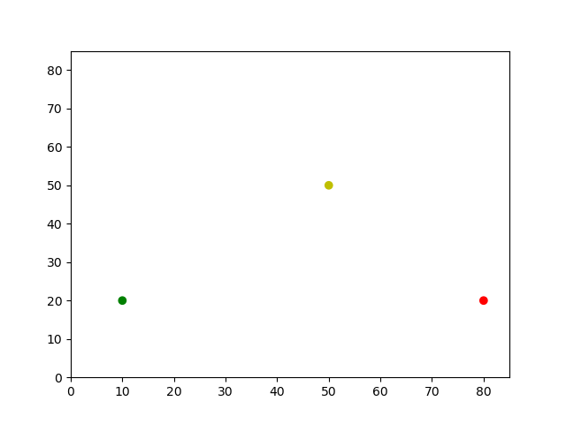
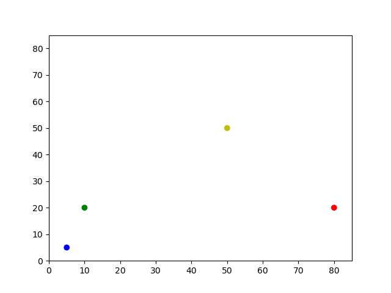
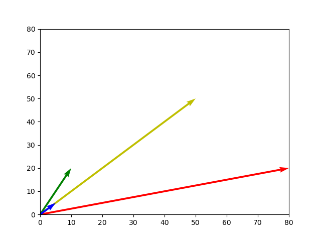

Vector Space
==================
Many NLP models make use of a concept called Vector Space. This is a very complex concept, and so we will be starting with some basic assumptions of the model.
Many of these assumptions will later be broken down or ignored. We are starting with a simplified version of the model and will scale up in complexity.

1)	We create __embeddings__, or surrogates, of words and documents in vector space. 
2)	These embeddings should be based on some sort of __feature extraction__, meaning that meaningful features from our original documents are somehow represented in our embedding. This will make it so that relationships between embeddings in this vector space will correspond to relationships in the actual documents.
3)	We have a “bag of words” assumption as well. We will not consider the placement of words in sentences, their context or their conjugation into different forms (run vs ran) to start. The effect of this assumption is like putting all words from a sentence in a bag and considering them by count without regard to order. Later, we’ll talk about embeddings where this no longer holds true.

We start with a very simple set of toy documents. These model documents contain only two words, but we will show how it can be expanded to fit an arbitrarily large vocabulary. 

We will use a 2-dimensional vector space model to represent those words. We will say that dimension one represents the number of times word A occurs, and dimension two represents the number of times word B occurs. Let's model three documents using this model.

| Document   | Word A      | Word B |
| ---------- | ----------- | ----------- |
| Document A | 50 | 50 |
| Document B | 80 | 20 |
| Document C | 10 | 20 |


```python
import numpy as np
import scipy as sp	
pointA = np.array((50, 50))
pointB = np.array((80, 20))
pointC = np.array((10,20))
```



Which document is C the most like? 
--------------
One way we could calculate this is by using a distance formula. 
The Euclidian distance formula makes use of the Pythagorean theorem, where a^2 + b^2 = c^2. 
We can draw a triangle between two points, and calculate the hypotenuse to find the distance. 
This distance formula can be generalized over as many dimensions as we want.
Numpy is a math library used by spacy. We will use it to demonstrate our model.


```python
def euclid(pointA, pointB): 
	sum_sq = np.sum(np.square(pointA – pointB))
	print(np.sqrt(sum_sq))
```

Now we can calculate distance between two documents.
```python
euclid(pointA, pointC)
euclid(pointB, pointC)
```

~~~
50
70
~~~

We would conclude that A and C are the most similar because they have the least distance between the two points. 
This is a simple model to determine document similarity. Let’s add another document to our two word model from before- document D. 
Let’s say this document is shorter than the others, but very similar to document A. We'll say the same words are in the same proportions.
In fact, let's say that document A is just document D copy and pasted ten times.




```python
pointD = np.array((5,5))
euclid(pointA, pointD)
euclid(pointB, pointD)
euclid(pointC, pointD)
```


Notice that document A is not the closest document to D! This is why we don't consider documents as points, but rather as vectors. 
Vectors are geometric objects with both length and direction. They can be thought of as a ray or an arrow pointing from one point to another. 
Consider documents as vectors, going from the origin at (0,0) to each document, represented by the word count coordinates above.
 

 
Instead of using distance as our measure, which is highly dependent on document length, we can instead use a metric called cosine similarity. 
Cosine similarity measures the angle between two vectors without considering the difference in each document’s size. 
It is only concerned with the direction of the vector, not its length. The more similar two vectors are in direction, 
the closer the cosine similarity score gets to 1. And the more orthogonal two vectors get, the closer it gets to 0. 


```python
def cosSim(pointA, pointB):
	Print(Np.dot(pointA, pointB) / (np.linalg.norm(pointA) * np.linalg.norm(pointB)))

cosSim(pointA, pointD)
cosSim(pointB, pointD)
cosSim(pointC, pointD)
```

We can now see that documents A and D have an identical score.

Generalizing over more dimensions
==================

If we want to add another word to our model, we simply add another dimension, which we can represent as another column in our table.

| Document   | Word A      | Word B | Word C |
| ---------- | ----------- | ----------- | --------- |
| Document A | 50 | 50 | 45|
| Document B | 80 | 20 | 20|
| Document C | 10 | 20 | 5|

```python
pointA = np.array((50, 50, 45))
pointB = np.array((80, 20, 20))
pointC = np.array((10,20,5))
```

We can do this for however many words we want to add. It’s still possible to visualize a graph with only three words as existing in three dimensions, but visualizing will rapidly become very difficult as we add more and more words. 
Vocabularies for natural languages can easily reach thousands of words, and a space with thousands of dimensions is difficult to mentally visualize. 
However, it’s not necessary to visualize how a high dimensional vector space looks. 
We can still calculate things like distance and cosine similarity over an arbitrary number of dimensions since the formulae work over an arbitrary number of dimensions. 

```python
euclid(pointA, pointB)
cosSim(pointA, pointB)
```

Both methods still work and will work no matter how many dimensions we add.
This principle of using vector space will hold up over an arbitrary number of dimensions, and therefore over a vocabulary of arbitrary size. 
This is the essence of vector space modelling- documents are embedded as coordinates and vectors in very high dimensional space.
Methods for feature extraction may change and become more complex, but the essential idea remains the same.

