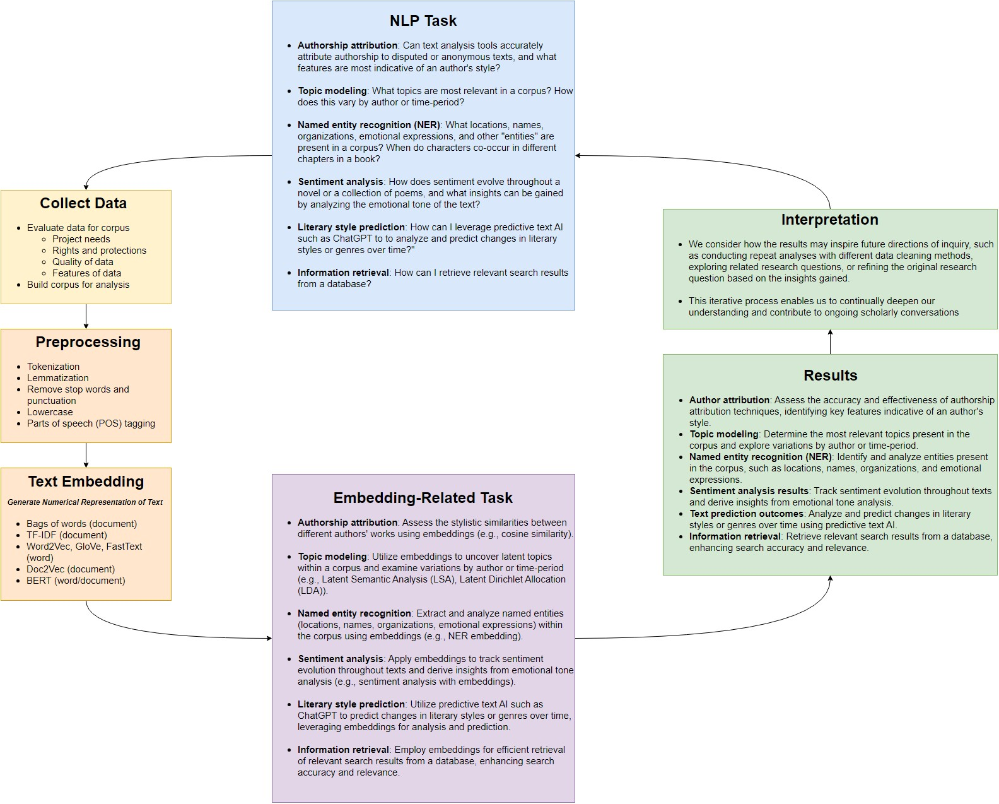
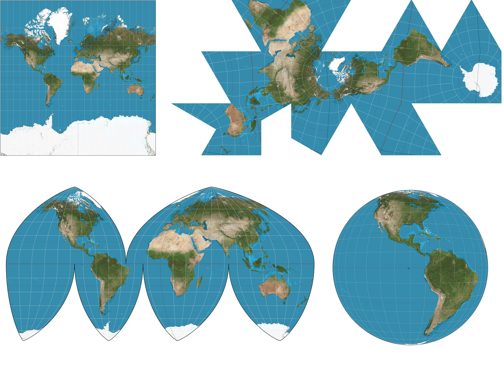
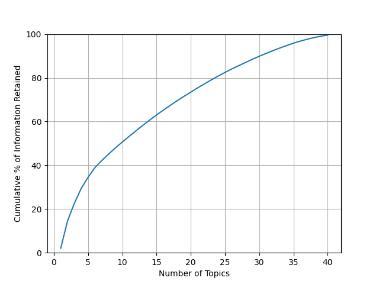
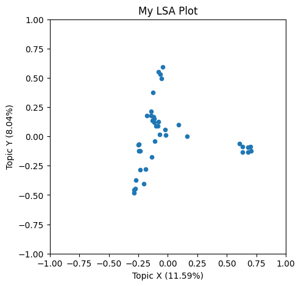
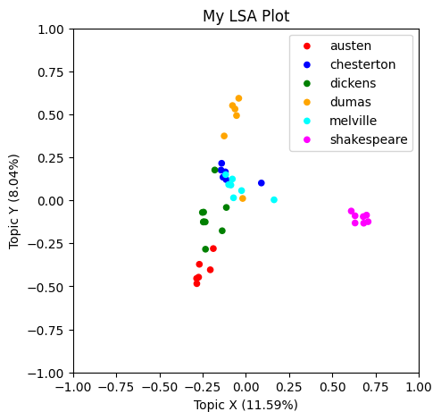

So far, we've learned the kinds of task NLP can be used for, preprocessed our data, and represented it as a TF-IDF vector space.

Now, we begin to close the loop with Topic Modeling — one of many embedding-related tasks possible with NLP.



Topic Modeling is a frequent goal of text analysis. Topics are the things that a document is about, by some sense of "about." We could think of topics as:

- discrete categories that your documents belong to, such as fiction vs. non-fiction
- or spectra of subject matter that your documents contain in differing amounts, such as being about politics, cooking, racing, dragons, ...

In the first case, we could use machine learning to predict discrete categories, such as [trying to determine the author of the Federalist Papers](https://towardsdatascience.com/hamilton-a-text-analysis-of-the-federalist-papers-e64cb1764fbf).

In the second case, we could try to determine the least number of topics that provides the most information about how our documents differ from one another, then use those concepts to gain insight about the "stuff" or "story" of our corpus as a whole.

In this lesson we'll focus on this second case, where topics are treated as spectra of subject matter. There are a variety of ways of doing this, and not all of them use the vector space model we have learned. For example:

- Vector-space models:
  - Principle Component Analysis (PCA)
  - Epistemic Network Analysis (ENA)
  - Latent Semantic Analysis (LSA)
- Probability models:
  - Latent Dirichlet Allocation (LDA)

Specifically, we will be discussing Latent Semantic Analysis (LSA). We're narrowing our focus to LSA because it introduces us to concepts and workflows that we will use in the future, in particular that of dimensional reduction.

## What is dimensional reduction?

Think of a map of the Earth. The Earth is a three dimensional sphere, but we often represent it as a two dimensional shape such as a square or circle. We are performing dimensional reduction- taking a three dimensional object and trying to represent it in two dimensions.



Why do we create maps? It can often be helpful to have a two dimensional representation of the Earth. It may be used to get an approximate idea of the sizes and shapes of various countries next to each other, or to determine at a glance what things are roughly in the same direction. 

How do we create maps? There's many ways to do it, depending on what properties are important to us. We cannot perfectly capture area, shape, direction, bearing and distance all in the same model- we must make tradeoffs. Different projections will better preserve different properties we find desirable. But not all the relationships will be preserved- some projections will distort area in certain regions, others will distort directions or proximity. Our technique will likely depend on what our application is and what we determine is valuable.

Dimensional reduction for our data is the same principle. Why do we do dimensional reduction? When we perform dimensional reduction we hope to take our highly dimensional language data and get a useful 'map' of our data with fewer dimensions. We have various tasks we may want our map to help us with. We can determine what words and documents are semantically "close" to each other, or create easy to visualise clusters of points.

How do we do dimensional reduction? There are many ways to do dimensional reduction, in the same way that we have many projections for maps. Like maps, different dimensional reduction techniques have different properties we have to choose between- high performance in tasks, ease of human interpretation, and making the model easily trainable are a few. They are all desirable but not always compatible. When we lose a dimension, we inevitably lose data from our original representation. This problem is multiplied when we are reducing so many dimensions. We try to bear in mind the tradeoffs and find useful models that don't lose properties and relationships we find important. But "importance" depends on your moral theoretical stances. Because of this, it is important to carefully inspect the results of your model, carefully interpret the "topics" it identifies, and check all that against your qualitative and theoretical understanding of your documents.

This will likely be an iterative process where you refine your model several times. Keep in mind the adage: all models are wrong, some are useful, and a less accurate model may be easier to explain to your stakeholders.

## LSA

The assumption behind LSA is that underlying the thousands of words in our vocabulary are a smaller number of hidden ("latent") topics, and that those topics help explain the distribution of the words we see across our documents. In all our models so far, each dimension has corresponded to a single word. But in LSA, each dimension now corresponds to a hidden topic, and each of those in turn corresponds to the words that are most strongly associated with it.

For example, a hidden topic might be [the lasting influence of the Battle of Hastings on the English language](https://museumhack.com/english-language-changed/), with some documents using more words with Anglo-Saxon roots and other documents using more words with Latin roots. This dimension is "hidden" because authors don't usually stamp a label on their books with a summary of the linguistic histories of their words. Still, we can imagine a spectrum between words that are strongly indicative of authors with more Anglo-Saxon diction vs. words strongly indicative of authors with more Latin diction. Once we have that spectrum, we can place our documents along it, then move on to the next hidden topic, then the next, and so on, until we've discussed the fewest, strongest hidden topics that capture the most "story" about our corpus.

LSA requires two steps- first we must create a TF-IDF matrix, which we have already covered in our previous lesson. 

Next, we will perform dimensional reduction using a technique called SVD.

### Worked Example: LSA
In case you are starting from a fresh notebook, you will need to (1), mount Google drive (2) add the helper code to your path, (3) load the data.csv file, and (4) pip install parse which is used in the helper function code.

```python
# Run this cell to mount your Google Drive.
from google.colab import drive
drive.mount('/content/drive')

# Show existing colab notebooks and helpers.py file
from os import listdir
wksp_dir = '/content/drive/My Drive/Colab Notebooks/text-analysis/code'
listdir(wksp_dir)

# Add folder to colab's path so we can import the helper functions
import sys
sys.path.insert(0, wksp_dir)

# Read the data back in.
from pandas import read_csv
data = read_csv("/content/drive/My Drive/Colab Notebooks/text-analysis/data/data.csv")

```

```python
!pip install pathlib parse # parse is used by helper functions
```

Mathematically, these "latent semantic" dimensions are derived from our TF-IDF matrix, so let's begin there. From the previous lesson:

```python
from sklearn.feature_extraction.text import TfidfVectorizer
vectorizer = TfidfVectorizer(input='filename', max_df=.6, min_df=.1) # Here, max_df=.6 removes terms that appear in more than 60% of our documents (overly common words like the, a, an) and min_df=.1 removes terms that appear in less than 10% of our documents (overly rare words like specific character names, typos, or punctuation the tokenizer doesn’t understand)
tfidf = vectorizer.fit_transform(list(data["Lemma_File"]))
print(tfidf.shape)
```

~~~
(41, 9879)
~~~
{: .output}

What do these dimensions mean? We have 41 documents, which we can think of as rows. And we have several thousands of tokens, which is like a dictionary of all the types of words we have in our documents, and which we represent as columns.

#### Dimension Reduction Via Singular Value Decomposition (SVD)
Now we want to reduce the number of dimensions used to represent our documents. We will use a technique called Singular Value Decomposition (SVD) to do so. SVD is a powerful linear algebra tool that works by capturing the underlying patterns and relationships within a given matrix. When applied to a TF-IDF matrix, it identifies the most significant patterns of word co-occurrence across documents and condenses this information into a smaller set of "topics," which are abstract representations of semantic themes present in the corpus. By reducing the number of dimensions, we gradually distill the essence of our corpus into a concise set of topics that capture the key themes and concepts across our documents. This streamlined representation not only simplifies further analysis but also uncovers the latent structure inherent in our text data, enabling us to gain deeper insights into its content and meaning.

To see this, let's begin to reduce the dimensionality of our TF-IDF matrix using SVD, starting with the greatest number of dimensions (min(#rows, #cols)). In this case the maxiumum number of 'topics' corresponds to the number of documents- 41.

```python
from sklearn.decomposition import TruncatedSVD

maxDimensions = min(tfidf.shape)-1

svdmodel = TruncatedSVD(n_components=maxDimensions, algorithm="arpack") # The "arpack" algorithm is typically more efficient for large sparse matrices compared to the default "randomized" algorithm. This is particularly important when dealing with high-dimensional data, such as TF-IDF matrices, where the number of features (terms) may be large. SVD is typically computed as an approximation when working with large matrices.

lsa = svdmodel.fit_transform(tfidf)

print(lsa)
```

~~~
[[ 3.91364432e-01 -3.38256707e-01 -1.10255485e-01 ... -3.30703329e-04
    2.26445596e-03 -1.29373990e-02]
  [ 2.83139301e-01 -2.03163967e-01  1.72761316e-01 ...  1.98594965e-04
  -4.41931701e-03 -1.84732254e-02]
  [ 3.32869588e-01 -2.67008449e-01 -2.43271177e-01 ...  4.50149502e-03
    1.99200352e-03  2.32871393e-03]
  ...
  [ 1.91400319e-01 -1.25861226e-01  4.36682522e-02 ... -8.51158743e-04
    4.48451964e-03  1.67944132e-03]
  [ 2.33925324e-01 -8.46322843e-03  1.35493523e-01 ...  5.46406784e-03
  -1.11972177e-03  3.86332162e-03]
  [ 4.09480701e-01 -1.78620470e-01 -1.61670733e-01 ... -6.72035999e-02
    9.27745251e-03 -7.60191949e-05]]
~~~
{: .output}

Unlike with a globe, we must make a choice of how many dimensions to cut out. We could have anywhere between 41 topics to 2. 

How should we pick a number of topics to keep? Fortunately, the dimension reducing technique we used produces something to help us understand how much data each topic explains.
Let's take a look and see how much data each topic explains. We will visualize it on a graph.

```python
import matplotlib.pyplot as plt
import numpy as np

#this shows us the amount of dropoff in explanation we have in our sigma matrix. 
print(svdmodel.explained_variance_ratio_)

# Calculate cumulative sum of explained variance ratio
cumulative_variance_ratio = np.cumsum(svdmodel.explained_variance_ratio_)

plt.plot(range(1, maxDimensions + 1), cumulative_variance_ratio * 100)
plt.xlabel("Number of Topics")
plt.ylabel("Cumulative % of Information Retained")
plt.ylim(0, 100)  # Adjust y-axis limit to 0-100
plt.grid(True)    # Add grid lines
```

~~~
[0.02053967 0.12553786 0.08088013 0.06750632 0.05095583 0.04413301
  0.03236406 0.02954683 0.02837433 0.02664072 0.02596086 0.02538922
  0.02499496 0.0240097  0.02356043 0.02203859 0.02162737 0.0210681
  0.02004    0.01955728 0.01944726 0.01830292 0.01822243 0.01737443
  0.01664451 0.0160519  0.01494616 0.01461527 0.01455848 0.01374971
  0.01308112 0.01255502 0.01201655 0.0112603  0.01089138 0.0096127
  0.00830014 0.00771224 0.00622448 0.00499762]
~~~
{: .output}



Often a heuristic used by researchers to determine a topic count is to look at the dropoff in percentage of data explained by each topic.

Typically the rate of data explained will be high at first, dropoff quickly, then start to level out. We can pick a point on the "elbow" where it goes from a high level of explanation to where it starts leveling out and not explaining as much per topic. Past this point, we begin to see diminishing returns on the amount of the "stuff" of our documents we can cover quickly. This is also often a good sweet spot between overfitting our model and not having enough topics.

Alternatively, we could set some target sum for how much of our data we want our topics to explain, something like 90% or 95%. However, with a small dataset like this, that would result in a large number of topics, so we'll pick an elbow instead.

Looking at our results so far, a good number in the middle of the "elbow" appears to be around 5-7 topics. So, let's fit a model using only 6 topics and then take a look at what each topic looks like.

> ## Why is the first topic, "Topic 0," so low?
>
> It has to do with how our SVD was setup. Truncated SVD does not mean center the data beforehand, which takes advantage of sparse matrix algorithms by leaving most of the data at zero. Otherwise, our matrix will me mostly filled with the negative of the mean for each column or row, which takes much more memory to store. The math is outside the scope for this lesson, but it's expected in this scenario that topic 0 will be less informative than the ones that come after it, so we'll skip it.
{: .callout}

```python
numDimensions = 7
svdmodel = TruncatedSVD(n_components=numDimensions, algorithm="arpack")
lsa = svdmodel.fit_transform(tfidf)
print(lsa)
```

~~~
[[ 3.91364432e-01 -3.38256707e-01 -1.10255485e-01 -1.57263147e-01
  4.46988327e-01  4.19701195e-02 -1.60554169e-01]
  ...
~~~
{: .output}

And put all our results together in one DataFrame so we can save it to a spreadsheet to save all the work we've done so far. This will also make plotting easier in a moment.

Since we don't know what these topics correspond to yet, for now I'll call the first topic X, the second Y, the third Z, and so on.

```python
data[["X", "Y", "Z", "W", "P", "Q"]] = lsa[:, [1, 2, 3, 4, 5, 6]]
data.head()
```

Let's also mean-center the data, so that the "average" value per topic (across all our documents) lies at the origin when we plot things in a moment. By mean-centering, you are ensuring that the "average" value for each topic becomes the reference point (0,0) in the plot, which can provide more informative insights into the relative distribution and relationships between topics.

```python
data[["X", "Y", "Z", "W", "P", "Q"]] = lsa[:, [1, 2, 3, 4, 5, 6]]-lsa[:, [1, 2, 3, 4, 5, 6]].mean(0)
data[["X", "Y", "Z", "W", "P", "Q"]].mean()
```

~~~
X   -7.446618e-18
Y   -2.707861e-18
Z   -1.353931e-18
W   -1.184689e-17
P    3.046344e-18
Q    2.200137e-18
dtype: float64
~~~
{: .output}

Finally, let's save our progress so far.

```python
data.to_csv("/content/drive/My Drive/Colab Notebooks/text-analysis/data/data.csv", index=False)
```

## Inspecting LSA Results

### Plotting

Let's plot the results, using a helper we prepared for learners. We'll focus on the X and Y topics for now to illustrate the workflow. We'll return to the other topics in our model as a further exercise.

```python
from helpers import lsa_plot
lsa_plot(data, svdmodel)
```



What do you think these X and Y axes are capturing, conceptually?

To help figure that out, lets color-code by author to see if any patterns are immediately apparent.

```python
colormap = {
    "austen": "red",
    "chesterton": "blue",
    "dickens": "green",
    "dumas": "orange",
    "melville": "cyan",
    "shakespeare": "magenta"
}

lsa_plot(data, svdmodel, groupby="author", colors=colormap)
```



It seems that some of the books by the same author are clumping up together in our plot.

We don't know *why* they are getting arranged this way, since we don't know what more concepts X and Y correspond to. But we can work do some work to figure that out.

### Topics

Let's write a helper to get the strongest words for each topic. This will show the terms with the *highest* and *lowest* association with a topic. In LSA, each topic is a spectra of subject matter, from the kinds of terms on the low end to the kinds of terms on the high end. So, inspecting the *contrast* between these high and low terms (and checking that against our domain knowledge) can help us interpret what our model is identifying.

```python
import pandas as pd

def show_topics(vectorizer, svdmodel, topic_number, n):
    # Get the feature names (terms) from the TF-IDF vectorizer
    terms = vectorizer.get_feature_names_out()
    
    # Get the weights of the terms for the specified topic from the SVD model
    weights = svdmodel.components_[topic_number]
    
    # Create a DataFrame with terms and their corresponding weights
    df = pd.DataFrame({"Term": terms, "Weight": weights})
    
    # Sort the DataFrame by weights in descending order to get top n terms (largest positive weights)
    highs = df.sort_values(by=["Weight"], ascending=False)[0:n]
    
    # Sort the DataFrame by weights in ascending order to get bottom n terms (largest negative weights)
    lows = df.sort_values(by=["Weight"], ascending=False)[-n:]
    
    # Concatenate top and bottom terms into a single DataFrame and return
    return pd.concat([highs, lows])

# Get the top 5 and bottom 5 terms for each specified topic
topic_words_x = show_topics(vectorizer, svdmodel, 1, 5)  # Topic 1
topic_words_y = show_topics(vectorizer, svdmodel, 2, 5)  # Topic 2

```

You can also use a helper we prepared for learners:

```python
from helpers import show_topics
topic_words_x = show_topics(vectorizer, svdmodel, topic_number=1, n=5)
topic_words_y = show_topics(vectorizer, svdmodel, topic_number=2, n=5)
```

Either way, let's look at the terms for the X topic.

What does this topic seem to represent to you? What's the contrast between the top and bottom terms?

```python
print(topic_words_x)
```

~~~
            Term    Weight
8718        thou  0.369606
4026        hath  0.368384
3104        exit  0.219252
8673        thee  0.194711
8783         tis  0.184968
9435          ve -0.083406
555   attachment -0.090431
294           am -0.103122
5312          ma -0.117927
581         aunt -0.139385
~~~
{: .output}

And the Y topic.

What does this topic seem to represent to you? What's the contrast between the top and bottom terms?

```python
print(topic_words_y)
```

~~~
            Term    Weight
1221    cardinal  0.269191
5318      madame  0.258087
6946       queen  0.229547
4189       honor  0.211801
5746   musketeer  0.203572
294           am -0.112988
5312          ma -0.124932
555   attachment -0.150380
783    behaviour -0.158139
581         aunt -0.216180
~~~
{: .output}

Now that we have names for our first two topics, let's redo the plot with better axis labels.

```python
lsa_plot(data, svdmodel, groupby="author", colors=colormap, xlabel="Victorian vs. Elizabethan", ylabel="English vs. French")
```


> ## Check Your Understanding: Intrepreting LSA Results
>
> Let's repeat this process with the other 4 topics, which we tentatively called Z, W, P, and Q.
>
> In the first two topics (X and Y), some authors were clearly separated, but others overlapped. If we hadn't color coded them, we wouldn't be easily able to tell them apart.
>
> But in remaining topics, different combinations of authors get pulled apart or together. This is because these topics (Z, W, P, and Q) highlight different features of the data, *independent* of the features we've already captured above.
>
> Take a few moments to work through the steps above for the remaining dimensions Z, W, P, and Q, and chat with one another about what you think the topics being represented are.
{: .challenge}
