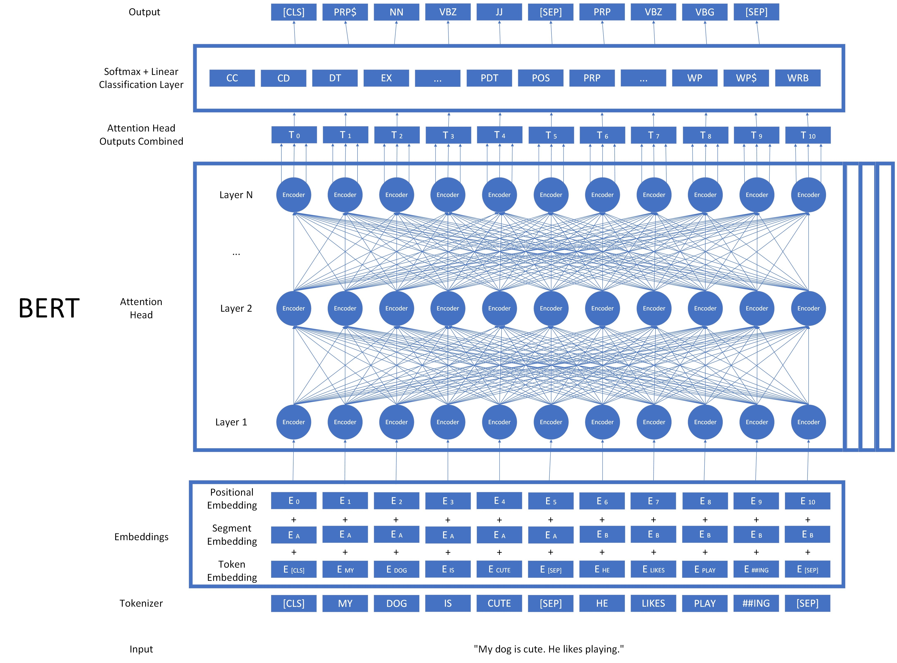
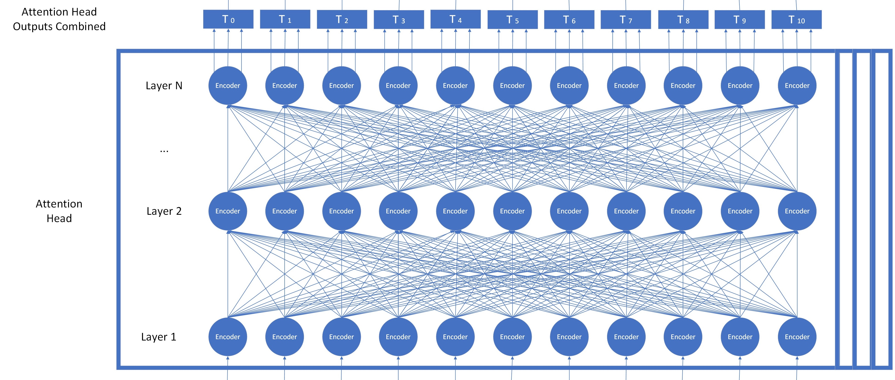

# Transformers and BERT

## What are large language models? What is BERT?

For this lesson, we will be learning about large language models (LLMs).

LLMs are the current state of the art when it comes to many tasks, and although LLMs can differ, they are mostly based on a similar architecture to one another.

We will go through the architecture of a highly influential LLM called BERT. BERT stands for Bidirectional Encoder Representations from Transformers. Let's look at each part of this model, starting with the input on the bottom and working toward the output on the top.



This is a complex architecture, but it can be broken down into many of the things we've learned in this course. The model is displayed with the input on the bottom and the output at the top, as is common with neural networks. Let's take a look at one component at a time.

### Tokenizer

First, the input string is broken up by a tokenizer. The tokens are created using a tokenizer which breaks words into smaller lexical units called morphemes rather than words. There are two special types of tokens in this tokenizer. The [CLS] token indicates the start of the document. The [SEP] token indicates the end of a document, or a "segment". Let's look at the tokenizer in action.

```python
!pip install parse bertviz transformers
```

```python
from transformers import BertTokenizer
sentence="My dog Fido is cute. He likes playing."
tokenizer = BertTokenizer.from_pretrained("bert-base-cased")
encoding = tokenizer.encode(sentence)

#this will give us the ID number of our tokens.
print(encoding)
#this will give us the actual tokens.
print(tokenizer.convert_ids_to_tokens(encoding))
```

```txt
[101, 1422, 3676, 17355, 2572, 1110, 10509, 119, 1124, 7407, 1773, 119, 102]
['[CLS]', 'My', 'dog', 'Fi', '##do', 'is', 'cute', '.', 'He', 'likes', 'playing', '.', '[SEP]']
```

### Embeddings


Next the model calculates an embedding for each token. Three values are used to calculate our final embedding for each token. The first part is the token embedding, similar to the ones we have discussed with Word2Vec and Glove, only this embedding is trained by the BERT model. For BERT, this algorithm is called WordPiece. The second part is a combination of all the tokens in a given segment, also called a segment embedding. The third part is a positional embedding, which accounts for the locations of words in the document. All three parts are combined as the embedding that is fed into the model. This is how we get our initial input into the model.

### Transformers

Now we are ready to use the main component of BERT: transformers.

Transformers were developed in 2017 by a group of researchers working at Google Brain. This was a revolutionary component that allowed language models to consider all words in a document at the same time in parellel, which sped up model training considerably and opened the door to LLMs.

Transformers make use of something called "self-attention calculation," which mimics how humans focus in on multiple parts of the document and weigh them differently when considering the meaning of a word. Self attention not only factors in the embeddings from other words in the sentence but weighs them depending on their importance.

It is not necessary to understand the exact details of the calculation for this lesson, but if you are interested on the mathematics of self-attention and the details of the calculation, the Illustrated Transformer is an excellent resource: <https://jalammar.github.io/illustrated-transformer/>



You can see in our BERT diagram that each embedding of the word is fed into a transformer called an 'encoder.' Each encoder in a layer runs a self attention calculation and forwards the results to each encoder in the next layer, which runs them on the outputs of the layer before it. Once the attention calculation has been run for each layer, a sophisticated embedding for each input token is output.

One additional detail about this process: it does not happen for just one set of weights. Instead, several independent copies of these encoders are trained and used, all at the same time. Each set of these transformers is called an "attention head."

Each attention head has its own set of weights called parameters that are trained and calculated independently. They are trained using the same type of cloze tasks to fill in masked words that we used to train Word2Vec. All of the outputs of the attention heads are combined together to make a large matrix of values that represents a very robust representation of the input, which we have labelled "T."

Let's take a look at how attention works in an example. Imagine we have two sentences, "The chicken didn't cross the road because it was too tired," and, "The chicken didn't cross the road because it was too wide." These are very similar sentences, but changing one word changes the meaning of both sentences dramatically. For the first sentence, 'it was too tired' refers to the chicken. For the second sentence, 'it was too wide' refers to the road. Ideally our representations for the road or chicken will incorporate these attributes.

```python
# Run this cell to mount your Google Drive.
from google.colab import drive
drive.mount('/content/drive')

# Show existing colab notebooks and helpers.py file
from os import listdir
wksp_dir = '/content/drive/My Drive/Colab Notebooks/text-analysis'
listdir(wksp_dir)

# Add folder to colab's path so we can import the helper functions
import sys
sys.path.insert(0, wksp_dir)
```

```python
import attentionviz as av
sentence_a = "The chicken didn't cross the road because it was too tired"
sentence_b = "The chicken didn't cross the road because it was too wide"
tfviz = av.AttentionViz(sentence_a, sentence_b)
tfviz.hview()
```

This visualization shows how attention works in the BERT model. The different colors represent different attention heads. The left side represents the input embedding and the depth of color shows how much each input weighs in the output of that layer.

Select "Sentence A to Sentence A" on the attention dropdown and mouse over the word "it." In layers 0-7 we can see how different attention heads start to incorporate the embedding of "because" and "too tired" into our embedding for "it." Once we get to layers 8-10, we can see how "chicken" starts to attend to the word "it", indicating that the model has started to incorporate the qualities of being "too tired" that are already part of "it" into the representation for "chicken". Mousing over the word "it" we can also see that it starts to incorporate the embedding built into the word "chicken."

How do you suppose the self attention calculation will change for sentence B? If we look at layers 8-10 we see that "the road" starts to attend to the word "it", rather than the chicken doing so. Self attention can shift to focus on different words depending on the input.

### Output and Classification


Once the input embeddings have been run through each layer and attention head, all of the outputs are combined together to give us a very robust matrix of values that represent a word and its relationships to other words, which we've called T. Training this component of the model is the vast majority of the work done in creating a pretrained large language model. But now that we have a very complex representation of the word, how do we use it to accomplish a task?

The last step in BERT is the classification layer. During fine-tuning, we add one more layer to our model- a set of connections that calculate the probability that each transformed token T matches each possible output. A much smaller set of test data is then used to train the final layer and refine the other layers of BERT to better suit the task.

## The Power of Transfer Learning


Above is a set of images from the creators of BERT showing how it could be easily adapted to different tasks. One of the reasons BERT became so ubiquitous is that it was very effective at transfer learning. Transfer learning means that the underlying model can be repurposed for different tasks.

The underlying large language model for BERT was trained for thousands of compute hours on hundreds of millions of words, but the weights calculated can be reused on a variety of tasks with minimal adaptation. The model does get fine-tuned for each task, but this is much easier than the initial training.

When we adapt BERT for a given NER task, we just need to provide a much smaller set of labelled data to retrain the last step of converting our output into a set of probabilities. These models have had great success at a variety of tasks like parts of speech tagging, translation, document summary, and NER labelling.

State of the art LLMs like GPT-4 operate on this approach. LLMs have grown larger and larger to take advantage of the ability to compute in parallel. Modern LLMs have become so large that they are often run on specialied high performance machines, and only exposed to the public via API. They are scaled up versions, still using transformers as their primary component. LLM's have also become better at so called "zero-shot" tasks, where there is no fine-tuning phase, and instead the model is exposed to novel classes it has never seen outside of its test data. However, fine-tuning is still an important part of maximizing performance.

At the beginning of our carpentries lessons, we used pretrained HuggingFace models to learn about different tasks we could accomplish using NLP. In our next lesson we will fine tune BERT to perform a custom task using a custom dataset.
